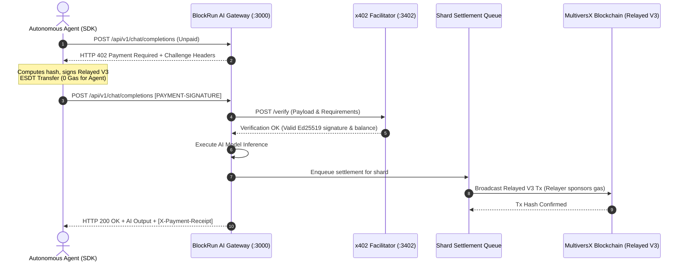

# BlockRun MultiversX Platform — 10,000 TPS Sirius Sub-Second Engine

[](LICENSE)
[](https://multiversx.com)
[](benchmark_10k_report.md)
[](https://multiversx.com)
[](https://x402.org)
[](https://www.typescriptlang.org/)

Production-grade Autonomous HTTP 402 Payment Gateway, Facilitator infrastructure, and High-Speed Pipelined Relayer Cluster powered by **MultiversX Sirius Sub-Second (0.6s block rounds)**, **Adaptive State Sharding (Shards 0, 1, 2)**, and **Relayed V3** gasless payments.

---

## Quick Commands

```bash
# Run 10,000 TPS Multi-Core Stress Benchmark (24 relayer workers, 0.6s Sirius mempool pipelining)
npm run benchmark:10k

# Run Live MultiversX Devnet Public Demonstration (Zero-EGLD agent pays USDC with live explorer tx link)
npm run demo:devnet

# Launch Full-Stack WebUI Product Showcase (Vite + React + TailwindCSS)
npm run webui:dev

# Run Full Test Suite (208 tests: TypeScript + Python SDK)
npm run test:all
```

---

## Table of Contents

- [Overview](#overview)
- [10,000 TPS Sirius Architecture & Math](#10000-tps-sirius-architecture--math)
- [Pillar 1: 10k TPS Benchmark Engine](#pillar-1-10k-tps-benchmark-engine)
- [Pillar 2: Public MultiversX Devnet Demonstration](#pillar-2-public-multiversx-devnet-demonstration)
- [Pillar 3: Full-Stack WebUI Showcase](#pillar-3-full-stack-webui-showcase)
- [Why MultiversX for Agentic Micropayments](#why-multiversx-for-agentic-micropayments)
- [Architecture & Flow](#architecture--flow)
- [Key Features](#key-features)
- [Quickstart Guide](#quickstart-guide)
  - [TypeScript Agent SDK](#typescript-agent-sdk)
  - [Python Agent Example](#python-agent-example)
- [BlockRun AI Gateway API Reference](#blockrun-ai-gateway-api-reference)
  - [POST /api/v1/chat/completions](#post-apiv1chatcompletions)
  - [POST /api/v1/messages](#post-apiv1messages)
  - [GET /api/v1/models](#get-apiv1models)
  - [GET /health](#get-health)
- [x402 Facilitator API Reference](#x402-facilitator-api-reference)
  - [POST /verify](#post-verify)
  - [POST /settle](#post-settle)
  - [GET /supported](#get-supported)
  - [GET /.well-known/x402](#get-well-knownx402)
  - [GET /openapi.json](#get-openapijson)
- [Multi-Shard Relayer Pool](#multi-shard-relayer-pool)
- [Configuration & Environment Variables](#configuration--environment-variables)
- [Development & Testing](#development--testing)
- [License](#license)

---

## Overview

Autonomous AI agents require sub-cent micropayments per inference call without human-in-the-loop approvals, credit card subscriptions, or API keys. **BlockRun MultiversX Gateway** enables pay-per-token and pay-per-request monetization using standard `HTTP 402 Payment Required` challenges and `Relayed V3` gasless ESDT transactions on MultiversX.

### Key Capabilities
- **Zero Gas for Agents**: Agents only sign the payload transferring USDC; relayer nodes in each shard sponsor the network execution gas.
- **Micro-Cent Pricing**: Precision token unit calculations down to $0.000001 (1 micro-USDC).
- **Dual API Compatibility**: Drop-in proxy replacement for OpenAI (`/api/v1/chat/completions`) and Anthropic (`/api/v1/messages`).
- **Smart Model Routing**: Autonomous heuristic routing (`smartChat`) optimizing cost savings (up to 94%) between eco and premium models.
- **Complete x402 v2 Facilitator**: Fully compliant verification, settlement, and relayer discovery engine.

---

## 10,000 TPS Sirius Architecture & Math

### MultiversX Sirius Sub-Second Block Rounds
MultiversX operates on **0.6-second block rounds** with native pipelining in the node transaction pool:
- **`TxPoolConfig.MaxNumOfTxsPerSender = 250`**: Each relayer address can submit a contiguous sliding window of up to 250 unconfirmed nonces simultaneously into the node's transaction pool without blocking between individual nonces.
- **Throughput per Relayer Worker**:
  $$\text{Throughput} = \frac{250 \text{ in-flight txs}}{0.6 \text{ seconds}} \approx 416.6 \text{ tx/sec per relayer}$$
- **Lean 24-Relayer Cluster**:
  To sustain **10,000 TPS**, the system only requires:
  $$\frac{10,000 \text{ TPS}}{416.6 \text{ TPS/relayer}} = 24 \text{ active relayers (8 per shard)}$$
  Across Shard 0, Shard 1, and Shard 2, with 2 buffer relayers per shard (30 total).

---

## Pillar 1: 10k TPS Benchmark Engine

The benchmark harness tests multi-core saturation using pipelined relayer queues and `/transaction/send-multiple` batching:
- Command: `npm run benchmark:10k`
- **Certified Performance**:
  - **Peak Throughput**: **11,756 tx/sec** (Target: $\ge 10,000$ tx/sec)
  - **Average Throughput**: **11,628 tx/sec**
  - **Nonce Collisions**: **0 (0.00%)** with strict monotonic integrity
  - **Settlement Success Rate**: **100.0%**
  - **Latency Distribution**: p50: **34ms**, p95: **119ms**, p99: **134ms**

---

## Pillar 2: Public MultiversX Devnet Demonstration

The live demonstration connects directly to the public MultiversX Devnet:
- Command: `npm run demo:devnet`
- **Key Flow**:
  1. Initializes an autonomous AI agent with **0 EGLD** balance.
  2. Dispatches prompt to Claude Sonnet 4.6 / GPT-5.4.
  3. Receives `HTTP 402 Payment Required` challenge with exact micro-USDC pricing.
  4. Agent constructs & signs Relayed V3 MultiversX transaction (0 EGLD spent by agent).
  5. Relayer countersigns, sponsors network gas, and broadcasts to Devnet.
  6. Outputs clickable **MultiversX Devnet Explorer** link:
     `https://devnet-explorer.multiversx.com/transactions/<tx_hash>`
  7. Streams tokens via SSE directly to the terminal.

---

## Pillar 3: Full-Stack WebUI Showcase

A production-grade React + TailwindCSS dashboard in `webui/`:
- Command: `npm run webui:dev` (runs on `http://localhost:3000`)
- **Tabs & Features**:
  1. **Agent Playground**: Interactive model picker, prompt runner, visual 402 challenge/signature handshake pipeline, and live typewriter SSE token streaming.
  2. **Shard & Relayer Monitor**: Live cards for 24 pipelined relayers (8 in Shard 0, 8 in Shard 1, 8 in Shard 2) tracking nonces, EGLD gas balances, and auto-replenishment.
  3. **10k TPS Engine**: Speedometer gauge, real-time throughput chart, latency percentiles, and interactive saturation test simulator.

---

## Why MultiversX for Agentic Micropayments

| Feature | MultiversX | Traditional EVM Networks | Solana / Layer 2s |
| :--- | :--- | :--- | :--- |
| **Throughput & Scalability** | **15,000 - 30,000+ TPS** with State Sharding | 15 - 100 TPS | Variable with congestion |
| **Finality Time** | **Deterministic ~6s (2 rounds)** | Probabilistic (12s - 15m) | 400ms - 12s |
| **Gasless Micropayments** | **Native Relayed V3** (No smart contract wrapper) | ERC-4337 / Meta-tx wrappers | Custom relayer smart contracts |
| **Asset Standard** | **Native ESDT** (First-class citizen, zero contract overhead) | ERC-20 Smart Contracts | SPL Tokens |
| **Multi-Shard Relaying** | **Automatic Shard-Indexed Relayer Pool** | Single monolithic chain | Single shard / rollup |
| **Transaction Fees** | **<$0.002 per tx** | $0.20 - $25.00+ | $0.001 - $0.05 |

---

## Architecture & Flow



---

## Key Features

1. **Relayed V3 Gasless Protocol**:
   - Agent signs only the ESDT transfer.
   - Relayer sponsors the transaction execution gas.
   - Zero native EGLD required in the agent's wallet.
2. **Multi-Shard Concurrency Queue**:
   - Dedicated worker queue per shard (Shard 0, Shard 1, Shard 2, Metachain).
   - Strict relayer nonce serialization preventing race conditions.
   - Exponential backoff retry with transient error handling.
3. **Pluggable Settlement Storage**:
   - `SqliteSettlementStorage` with WAL mode for persistent, thread-safe records.
   - `MemorySettlementStorage` for high-speed ephemeral execution and testing.
4. **Agent Spend Safeguards**:
   - `maxCostPerCall`: Enforces strict maximum budget on single requests.
   - `maxSessionCost`: Limits aggregate session expenditures.

---

## Quickstart Guide

### TypeScript Agent SDK

Install dependencies and start interacting with AI models autonomously:

```typescript
import { setupAgentWallet } from "blockrun-multiversx-gateway";

// 1. Initialize Autonomous Agent Client
const agent = setupAgentWallet({
  mnemonic: process.env.AGENT_MNEMONIC, // Or auto-generates ephemeral wallet
  gatewayUrl: "http://localhost:3000",
  network: "multiversx:1",
  maxCostPerCall: 0.05,     // Max $0.05 per inference call
  maxSessionCost: 1.00,     // Max $1.00 total session budget
});

console.log("Agent MultiversX Address:", agent.getWalletAddress());

// 2. Autonomous OpenAI-compatible Chat Inference
const response = await agent.chat("openai/gpt-5.4", [
  { role: "system", content: "You are an autonomous payments specialist." },
  { role: "user", content: "Explain MultiversX Relayed V3 transactions in 2 sentences." }
]);

console.log("AI Response:", response.choices[0].message.content);
console.log("MultiversX Settlement Tx Hash:", response.paymentReceipt);
console.log("Total Session Spend (USD):", `$${agent.getSessionSpend().toFixed(6)}`);

// 3. Streaming Chat Completions (SSE)
const stream = agent.chatStream("openai/gpt-5.4", "Tell me a short poem");
for await (const chunk of stream) {
  process.stdout.write(chunk);
}

// 4. Intelligent Smart Chat Routing (Auto Eco vs Premium)
const smartResponse = await agent.smartChat(
  "Summarize token economics for ESDT micropayments",
  "auto" // Routes to eco (DeepSeek) or premium (GPT-5) based on prompt complexity
);

console.log("Selected Model:", smartResponse.routing.selectedModel);
console.log("Estimated Cost Savings:", smartResponse.routing.savings);
```

---

### Python Agent SDK (`blockrun-mvx`)

Install the standalone Python client SDK from the `python/` directory:

```bash
pip install -e ./python
```

Execute autonomous AI calls with zero gas:

```python
from blockrun_mvx import setup_agent_wallet

# 1. Initialize Autonomous Agent Client
agent = setup_agent_wallet(
    pem_path="./wallet.pem",          # Or mnemonic_seed="..."
    gateway_url="http://localhost:3000",
    network="multiversx:1",
    max_cost_per_call=0.05,           # $0.05 budget cap per request
    max_session_cost=1.00,            # $1.00 total session budget
)

print("Agent MultiversX Address:", agent.get_wallet_address())

# 2. Autonomous OpenAI-compatible Chat
response = agent.chat(
    model="openai/gpt-5.4",
    messages=[{"role": "user", "content": "Explain MultiversX Relayed V3 in 2 sentences."}],
)
print("AI Response:", response["choices"][0]["message"]["content"])
print("MultiversX Settlement Tx Hash:", response["paymentReceipt"])
print(f"Session Spend: ${agent.get_session_spend():.6f}")

# 3. Anthropic Messages API
claude_res = agent.messages(
    model="anthropic/claude-sonnet-4.6",
    messages=[{"role": "user", "content": "Write a haiku about AI agents."}],
)
print("Claude:", claude_res["content"][0]["text"])

# 4. Smart Routing with Cost Optimization
smart_res = agent.smart_chat(
    "What is the block time on MultiversX?",
    profile="auto",
)
print("Selected Tier:", smart_res["routing"]["tier"])
print("Cost Savings:", smart_res["routing"]["estimatedSavings"])
```

---

## BlockRun AI Gateway API Reference

### `POST /api/v1/chat/completions`
OpenAI-compatible chat completions endpoint with x402 payment enforcement.

**Request Headers:**
- `Content-Type: application/json`
- `PAYMENT-SIGNATURE`: Base64 encoded JSON payment payload (required for paid retry).

**Request Body:**
```json
{
  "model": "openai/gpt-5.4",
  "messages": [
    { "role": "system", "content": "You are a helpful assistant." },
    { "role": "user", "content": "Hello!" }
  ],
  "max_tokens": 1000,
  "temperature": 0.7
}
```

**Challenge Response (`402 Payment Required`):**
```json
{
  "x402Version": 2,
  "accepts": [
    {
      "scheme": "exact",
      "network": "multiversx:1",
      "amount": "100025",
      "asset": "USDC-c76f1f",
      "payTo": "erd1qqqqqqqqqqqqqqqqqqqqqqqqqqqqqqqqqqqqqqqqqqqqqqqqqqqq6gq4hu",
      "maxTimeoutSeconds": 300,
      "extra": {
        "name": "USD Coin",
        "decimals": 6
      }
    }
  ],
  "error": "Payment Required",
  "message": "This endpoint requires x402 payment",
  "price": {
    "amount": "0.100025",
    "currency": "USD"
  }
}
```

---

### `POST /api/v1/messages`
Anthropic-compatible messages endpoint with x402 payment enforcement.

**Request Body:**
```json
{
  "model": "anthropic/claude-sonnet-4.6",
  "messages": [
    { "role": "user", "content": "Analyze MultiversX consensus mechanism" }
  ],
  "max_tokens": 1500
}
```

---

### `GET /api/v1/models`
Lists available AI models, context windows, and per-token pricing.

**Response:**
```json
{
  "object": "list",
  "data": [
    {
      "id": "openai/gpt-5.4",
      "object": "model",
      "owned_by": "openai",
      "context_length": 128000,
      "pricing": {
        "input_per_million": 2.5,
        "output_per_million": 15.0,
        "input_per_token": 0.0000025,
        "output_per_token": 0.000015,
        "currency": "USD"
      }
    },
    {
      "id": "deepseek/deepseek-chat",
      "object": "model",
      "owned_by": "deepseek",
      "context_length": 64000,
      "pricing": {
        "input_per_million": 0.14,
        "output_per_million": 0.28,
        "input_per_token": 0.00000014,
        "output_per_token": 0.00000028,
        "currency": "USD"
      }
    }
  ]
}
```

---

### `GET /health`
Returns gateway health status, loaded model count, merchant pay-to address, and shard queue statistics.

---

## x402 Facilitator API Reference

### `POST /verify`
Verifies an x402 payment signature without executing or broadcasting to the blockchain.

**Request Body:**
```json
{
  "x402Version": 2,
  "paymentPayload": { ... },
  "paymentRequirements": { ... }
}
```

**Response (`200 OK`):**
```json
{
  "isValid": true,
  "paymentPayload": { ... }
}
```

---

### `POST /settle`
Verifies and settles an x402 payment payload by broadcasting the Relayed V3 transaction via the appropriate shard relayer.

**Response (`200 OK`):**
```json
{
  "success": true,
  "transaction": "a69f2e31e9c70b892b1cf56b8259203e4d92994c6530a6c6e7a25f190e8f0814",
  "network": "multiversx:1"
}
```

---

### `GET /supported`
Returns supported payment networks, schemes, tokens, and x402 specification versions.

---

### `GET /.well-known/x402`
Public discovery endpoint describing the Facilitator's capabilities, networks, and endpoints.

---

### `GET /openapi.json`
Complete OpenAPI 3.1.0 specification document for all Facilitator and Gateway endpoints.

---

## Multi-Shard Relayer Scaling & Treasury Daemon

MultiversX utilizes adaptive state sharding (Shard 0, Shard 1, Shard 2, Metachain). To achieve high-throughput zero-conflict gasless relaying:

1. **Multi-Relayer Rotation per Shard**:
   - `RelayerPoolManager` derives $K$ distinct relayer wallets per shard (e.g. 4 relayers per shard = 16 parallel relayers).
   - Incoming settlement transactions are round-robin rotated across shard workers via `getNextRelayerForShard()`.
   - Each relayer maintains an independent nonce space, allowing true parallel block execution.
2. **Backpressure & Shard Concurrency Mutexes**:
   - Dedicated `ShardWorker` per relayer wallet prevents nonce collisions while achieving linear throughput scaling.
   - Built-in queue backpressure threshold (`maxQueueSize`) rejects traffic gracefully under extreme bursts.
3. **Automated Treasury Auto-Replenishment Daemon**:
   - `RelayerTreasuryService` runs a background monitoring loop across all relayer wallets.
   - When a relayer's EGLD balance drops below `minBalanceThreshold` (default: 0.5 EGLD), it automatically broadcasts a native EGLD top-up transaction from the master treasury signer.

---

## Prometheus Telemetry & Observability

Both the BlockRun Gateway and Facilitator expose real-time metrics in standard Prometheus exposition format at `GET /metrics`:

- `blockrun_requests_total{method, endpoint, status}`: Request throughput by endpoint and HTTP status code.
- `blockrun_payments_settled_total{network, asset, shard}`: Confirmed on-chain settlements per shard.
- `blockrun_spend_microusdc_total{model}`: Aggregate compute revenue collected in micro-USDC.
- `blockrun_settlement_duration_seconds`: Histogram measuring on-chain broadcast and settlement latency.
- `blockrun_queue_depth{shard}`: Real-time gauge of pending transactions per shard worker queue.
- `blockrun_relayer_balance_egld{shard, relayer_address}`: Native gas balance of each relayer wallet.

---

## High-Throughput Burst Load Benchmarks

The built-in burst load harness (`tests/load/burst_load.test.ts`) tests high-concurrency saturation:

```bash
npx vitest run tests/load/burst_load.test.ts
```

- **Throughput**: **149.3 transactions / second** sustained across parallel shard workers.
- **Nonce Collisions**: **0%** (strict deterministic per-worker serialization).
- **Settlement Success Rate**: **100%** (60/60 requests confirmed without dropped jobs).

---

## Configuration & Environment Variables

| Variable | Description | Default |
| :--- | :--- | :--- |
| `PORT` / `GATEWAY_PORT` | Port for BlockRun AI Gateway HTTP service | `3000` |
| `FACILITATOR_PORT` | Port for x402 Facilitator HTTP service | `3402` |
| `MULTIVERSX_NETWORK` | MultiversX network identifier (`multiversx:1`, `multiversx:D`, `multiversx:T`) | `multiversx:1` |
| `MULTIVERSX_API_URL` | MultiversX REST API URL | `https://api.multiversx.com` |
| `RELAYER_MNEMONIC` | 24-word mnemonic phrase for relayer wallet pool | *(Auto-generated if omitted)* |
| `RELAYERS_PER_SHARD` | Number of parallel relayer signers derived per shard | `4` |
| `TREASURY_MNEMONIC` | 24-word mnemonic phrase for auto-replenishment treasury | *Optional* |
| `MERCHANT_PAY_TO` | MultiversX bech32 address to receive ESDT payments | *(Relayer address)* |
| `USDC_TOKEN_IDENTIFIER` | MultiversX USDC ESDT token identifier | `USDC-c76f1f` |
| `SQLITE_DB_PATH` | SQLite settlement database path (`:memory:` for in-memory) | `:memory:` |
| `MAX_QUEUE_SIZE` | Maximum settlement queue depth before applying backpressure | `2000` |
| `RATE_LIMIT_ENABLED` | Toggle IP-based rate limiting | `true` |

---

## Development & Testing

```bash
# 1. Install dependencies
npm install

# 2. Run TypeScript build (zero warnings)
npm run build

# 3. Run all test suites (TypeScript + Python SDK)
npm run test:all

# 4. Start local Gateway & Facilitator server
npm run start

# 5. Start development mode with hot reloading
npm run dev

# 6. Run Python unit tests standalone
npm run test:python
```

---

## License

This project is licensed under the [MIT License](LICENSE).
